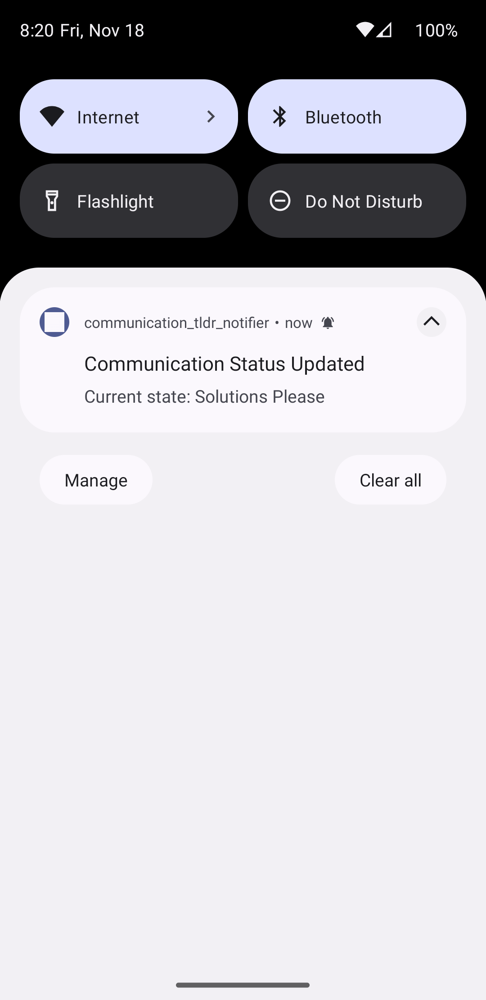
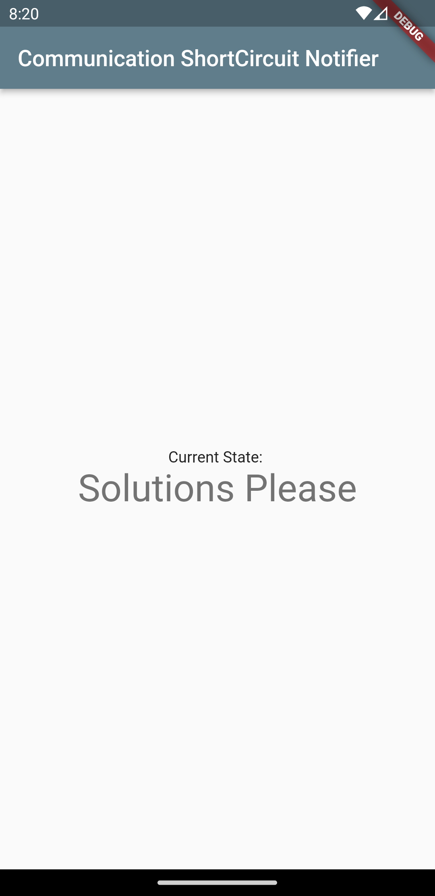
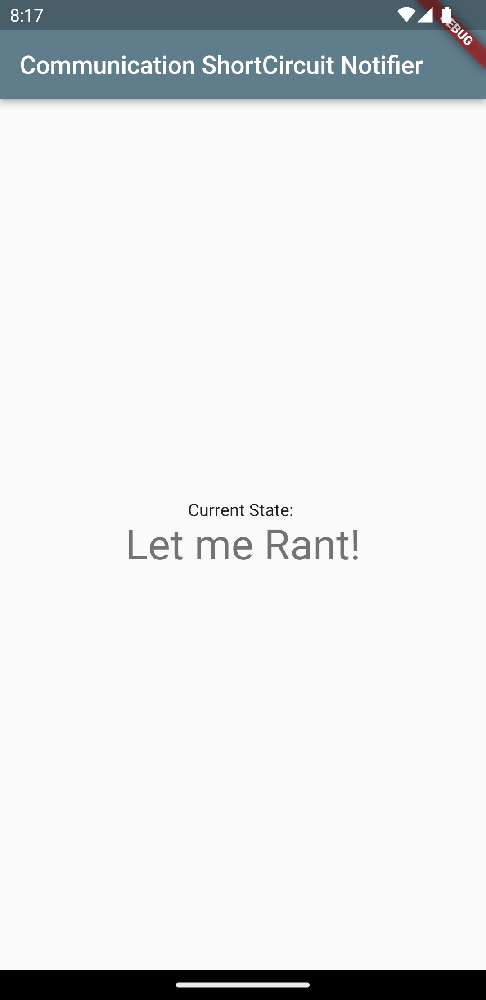

# app-communication-tldr-notifier

A Flutter project which creates a simple Android app that:

- Displays the current value stored at key `currentState` in a Firebase Database (that is `currentState`) in a simple widget
- Sends the user an app notification (FireBase messages) when the value of `currentState` has changed
  - Is subscribed to a topic `TLDR` and will display all notifications sent to it
- Makes use of FireBase Auth and enables Anonymous Authentication to the DB

## Why?

Acts as a receiver application to the sender application [app-communication-tldr](https://github.com/thameezb/app-communication-tldr/blob/main/README.md). More info can be found in that repo.

## Screenshots

